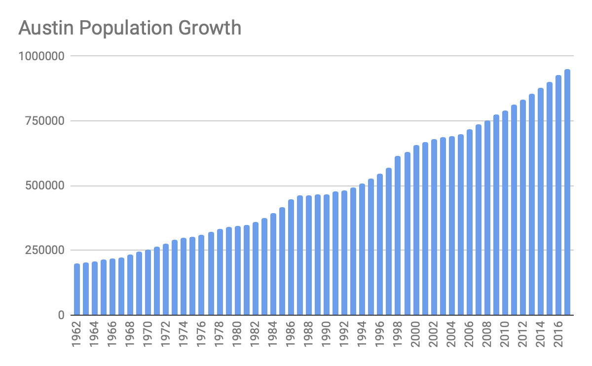
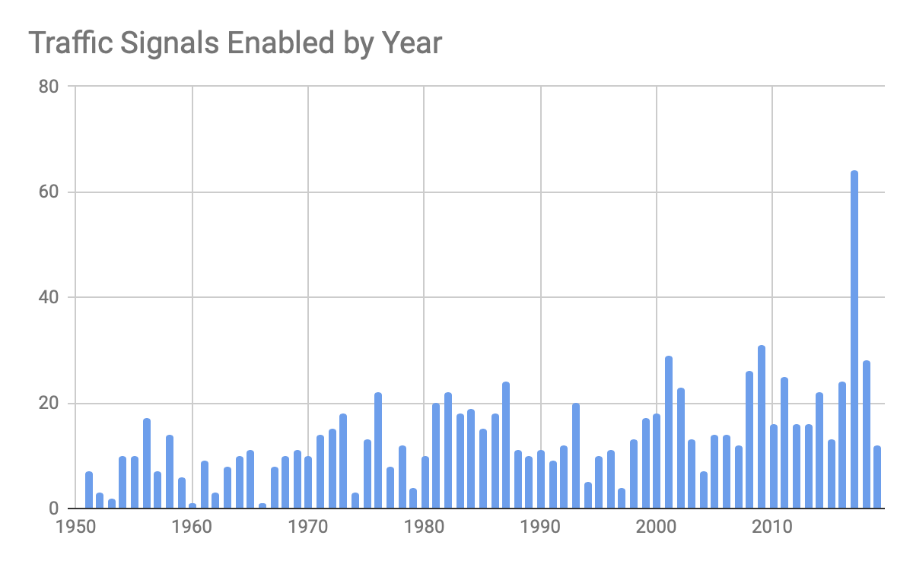
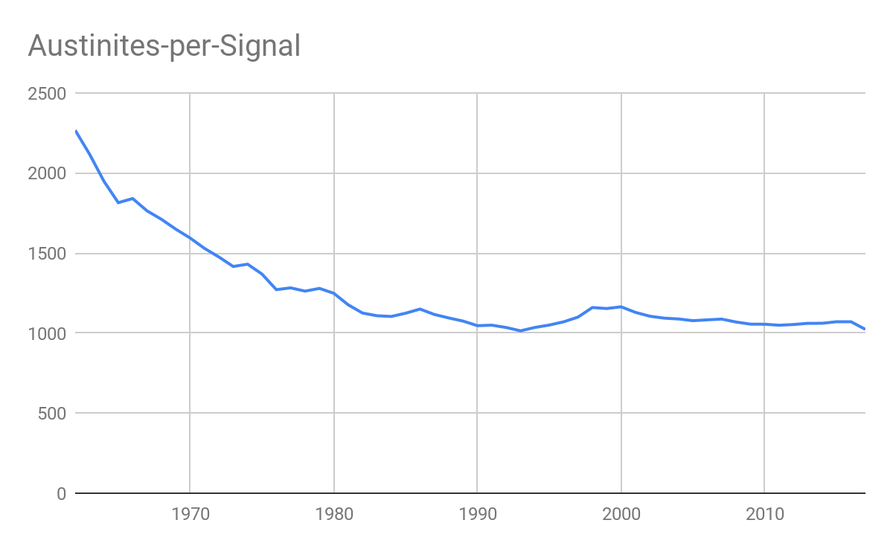
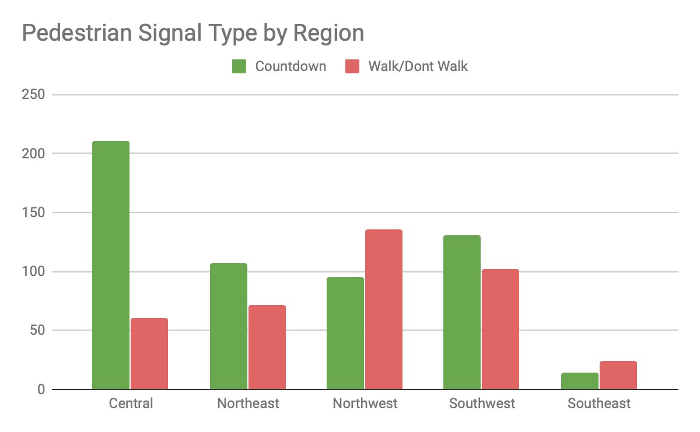

Every Wednesday in the Cloudflare Austin office a team member delivers a talk on a subject they want to share with the group. These discussions range from introductions to new programming languages to deep dives into video encoding. This week, I gave a presentation about how the City of Austin plans and finances roads and general transportation.

The short outline became a long discussion about roads, funding, and public transit. We spent some time talking about alternatives to cars, making roads wider, and the Michigan left. One thing that did not come up was traffic signals.

Traffic signals determine how cars flow in any given municipal area. They also govern the flow of people and bikes, often as secondary to cars. Cars sit at red lights, humans wait for “Walk” signals, sometimes buses use unique light queues to jump through congested areas. We don’t think about them that often, other than when we sit at a light, but they have a lot of impact on how we move about a city regardless of our transportation choice.

The City of Austin publishes a significant amount of data about its operations. One of the more obscure datasets is the traffic signal inventory. I was curious as to what I could learn about the City of Austin, and its traffic and growth, using this data.

## So how many signals are there?

The City of Austin maintains [1,006 active traffic signals](https://transportation.austintexas.io/ops-overview/). Seems small, right? Austin has been one of the fastest growing cities in the United States consistently in the last decade. The Austin Metropolitan Statistical Area is [home](https://www.austinchamber.com/economic-development/austin-profile/population) to over two million people, [roughly](http://www.austintexas.gov/demographics) one million of whom live in the city center. We can use the dataset to first map when active signals were installed, and we’ll then determine how that compares to population growth.

While Austin has experienced near exponential growth, traffic signal additions have remained relatively flat.

However, signals built in the 1950’s are still in use, which means that Austin has maintained a very consistent level of Austinites-per-signal over the last 30 years.

I don’t know if this is a good metric or not. A city of one million residents with a dozen traffic signals would, potentially, be a hellscape of congestion. The City seems pretty committed to 1,000 residents per signal, but I cannot find if this is a civil engineering standard or coincidence. I found it eerily consistent so I’m going to do more digging about it.

## So what does the city do with those signals?

Residents-per-signal seems pretty consistent, but so are the roads in Austin. Despite pretty aggressive growth, the major thoroughfares in the City remain relatively unchanged in the last few decades. The City of Austin does have authority over determining how these fixed physical objects respond to changes in traffic flow. A decision to allow a single traffic light to stay green longer can impact your commute quite a bit.

The Federal Highway Administration [recommends](https://ops.fhwa.dot.gov/publications/fhwahop08024/chapter7.htm#7.1) that municipalities review traffic signal timings every three to five years. Austinites seem less patient. In FY 2018, residents of Austin [submitted](https://www.austinmobilityreport.com/what-we-do-2018) 30,575 service requests to the City. Of those requests, 49.5% focus on traffic signals. How does the city respond?

In 2018, the City retimed 341 signals, or 34% of all active signals. At that rate, the City will retime the fleet of signals over three years, or the lower range prescribed by the federal Department of Transportation. However, the City did make 4,739 adjustments in the same year and claims 48,000 hours saved from both the retiming and adjustments, or tweaks, to that retiming.

The City cannot manually readjust every signal at any time of day. Instead, Austin relies on traffic detectors to automatically determine signal changes. In 2014, the City of Austin [installed](https://data.austintexas.gov/Transportation-and-Mobility/Traffic-Detectors/qpuw-8eeb) 27 traffic detectors. The Violet Crown city added 47 in 2015, and 34 in 2016. That pace changed in 2017 with 692 added and 150 in 2018.

## How does the City decide to add a signal?

New signals, in some roadways in Austin, are significant enough to warrant entire articles in the City’s paper of record when announced. In summer of 2018, a single traffic light added to a major thoroughfare made the [news](https://www.statesman.com/news/20180502/mixed-signals-loop-360-to-add-traffic-light-amid-plans-for-overpasses). In that case, the Texas Department of Transportation added the signal where a highway the State maintains intersects with municipal roads.

The traffic signal added in that article was paid for by a Condo Association in the area at a cost of $254,000. TxDOT installed the signal, but the City of Austin will maintain its timing. The State agency found that the intersection met their “four-hour warrant” – where the primary artery has at least 900 vehicles traverse the intersection over four hours while the secondary road had at least 100. Ownership of roads in Austin can be confusing; private residents paid for the State to install something that met their criteria on an intersection that sits entirely in Austin. That relationship is worth a separate post.

The City, when dealing with intersections entirely under its control, [has a process](https://www.austintexas.gov/trafficsignals) for collecting traffic signal requests and ranking them. Every December, Austin’s Mobility department ranks all requests using three criteria:

* Traffic observations
* Identification of pedestrian generators (establishments, developments or public spaces that generate pedestrian activity such as schools, multifamily developments, shops, parks and bus stops).
* Crash History Investigations

The Department then flags the top 10 locations and forwards them for further study. That study evaluates the intersection using [guidelines](http://ftp.dot.state.tx.us/pub/txdot-info/trf/tmutcd/2011-rev-2/4.pdf) set out by the State of Texas. These guidelines measure vehicular volume over multi-hour intervals and combine that data with pedestrian traffic and the presence of locations like schools. If a study leads to a recommendation, the City adds it to a construction list and eventually it becomes a real signal.

## What about pedestrians?

Traffic signals exist to determine automobile flow. Pedestrians respond to those patterns. The City categorizes pedestrian-indicators into three categories: None, Walk/Don’t Walk, and Countdown.

One thing that surprised me about this data is the prevalence of pedestrian signals. Before reviewing this data, I assumed that the minority of signals would feature some type of information for those of us on foot. Instead, 89% of signals have some type of information available to pedestrians.

Regionally, the central part of Austin features more countdown signals than any other region. More pedestrians walk through downtown and adjacent areas than other neighborhoods, so it makes sense this would be more common.

## What does it all mean?

Getting around in Austin can be tough. Summers [punish](https://www.statesman.com/news/20180905/austins-summer-of-2018-the-citys-third-hottest-ever-by-the-numbers) us with heat that can make cycling or walking to work unbearable. We lack a mass transit system that would be comparable to the denser cities on the Coasts. Instead, we look like most cities in the American South where the automobile dominated how the town expanded and grew. Austin is built on limestone, making a subway nearly impossible. Cars and buses offer the only viable method of commuting over long distances for most individuals.

We have also struggled to react quickly to growth on this scale. Major road improvements stem, primarily, from municipal bonds. Citizens must vote to approve bond proposals and the last major bond proposal approved was in 2016. The improvements from that proposal will, at the earliest, arrive seven years after the vote was taken. That’s not entirely a fault of the system, but a reality of route planning, environmental studies, and actual construction. Besides, building more roads might just invite more cars and we’ll maintain a level of congestion.

Traffic signals, in some cases, are the only option the City has to actively respond to congestion. Austin iterates, over ten times per day, on this system. When constrained by the timelines of road construction and voter approval, Austin transportation makes do with the most effective thing the City can control: how long you wait at a red light. It’s not perfect, but it’s sometimes the best option available. I need to remember that the next time I’m stuck. Or vote. I need to vote too.