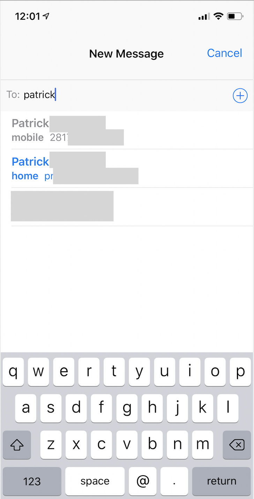
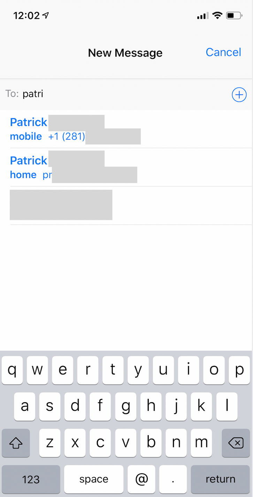
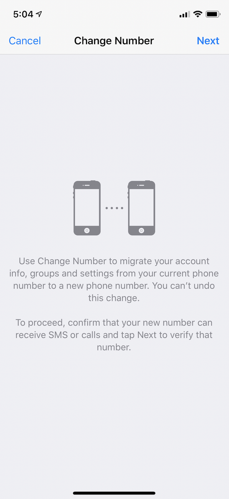

I spent the first three decades of my life entirely within the same area code. I had the same phone number for more than 16 years. I kept paying a bill that included talk, text, and data, but I assumed that the actual number was becoming less important over time.

**Why?**

* Text messages almost entirely replaced actual phone calls. I began to assume that, if it wasn’t an immediate family member, someone calling me unannounced was about to share breaking news.
* Then, text messages evolved into iMessage. 18 of my 20 closest contacts use iMessage. iMessage is tied to my phone number **and** my separate iCloud account username. With the iCloud username, I could use iMessage regardless of the number. While iMessage is a mostly American phenomena, a similar evolution took place with WhatsApp in places like Europe and South America.
* Professional communication and things like bills moved to email.
* I replaced SMS two-factor authentication with app-based TOTP and physical key alternatives.

The most important feature of my phone subscription became the data plan. As long as I had a data connection, I was set.

I was wrong. A few weeks ago, I left that single area code to move from Cloudflare’s Austin office to its [new location in Lisbon, Portugal](https://blog.cloudflare.com/cloudflare-lisbon-office/). I needed a Portuguese number for things like my lease and bank account, so I picked a provider based on their data plan. However, untangling my digital services from my US number became way more painful that I planned.

We replaced talk time and message counts with data limits. However, voice and SMS are desperately trying to cling to us as we evolve. Phone numbers are ghosts that haunt our digital lives. Please learn from my mistakes.

## iMessage and country codes

iOS stores contact numbers without requiring a country code. This works fine if you spend your whole life in the same country.

That breaks when you move abroad and use a phone plan in your new country, even for data-backed services that don’t use SMS like iMessage. In the example below, I’m attempting to start an iMessage conversation with my friend, Patrick. I have both his email used for iMessage and his phone number without the country code.

iMessage only recognizes the email as an iMessage recipient. Additionally, an SMS message to the phone number would fail without the code.

Fixing this for one person is simple – add the country code and they’re an iMessage recipient again (or an SMS one). However, you cannot do this in bulk.

Patrick is a bit of an exception: I have his Apple account email, where he can receive iMessage messages, in addition to his phone number. This isn’t the case for most of my contacts.

The rest of my friends and family? I’ll be manually adding “+1” in front of their numbers for a while.

One last note – your number just changed as well. You can avoid asking your friends and family to update your contact by changing your iMessage settings to send as the Apple account ID that you use. That username remains consistent so it’s a good habit to get into to have contacts and conversations use that address.

You can make that easier by changing settings in iMessage to start new conversations from your Apple account ID, rather than your phone number (past or present). You’ll probably have to introduce yourself, though, since it will look like a new contact for your friend.

### What to do? 

* Painfully update the numbers of those you love in your contacts with their country code
* Modify your settings to “Send as” your iCloud username

## WhatsApp and Signal

iMessage problems are distinctly American. If you’re moving to Europe, you live in a WhatsApp ecosystem now.

WhatsApp ties your account to your phone number. I had initially signed up for WhatsApp in the US so that I could communicate with some vendors helping with our move. Thankfully, WhatsApp makes it relatively easy to switch numbers while retaining your conversations and group chat memberships.

WhatsApp’s “Change Number” feature will migrate your WhatsApp account to use a new number while also updating contacts specific to the app to use this new number for you.

Signal does not make it easy. If you get a new number, or lose access to an old one, you have to [start from scratch](https://support.signal.org/hc/en-us/articles/360007062012-New-Number-or-New-Phone). Signal assumes you have an out-of-band way to communicate with your contacts that you can trust and use in the event that you lose your number or get a new one.

However, Signal sends messages using your data connection. Your number is used to associate your Signal account to the contact number your friends and family already use. So long as you have your Signal account active on your device, you can change numbers and continue to use it. This breaks down if you get a new device and lose access to your original number

### What to do? 

* WhatsApp solved this for you, don’t worry about it with that platform
* For Signal – use Google Voice or a dual SIM phone

## Authentication

Over time, I replaced SMS-based two-factor authentication (2FA) with time-based one-time password (TOTP) apps and physical key solutions. However, I’m sure that I forgot at least one and, in some cases, services want to call you and authenticate over a voice conversation.

Last week, I needed to wire money from my US bank account to my new Portuguese one. My US bank insisted on calling my US phone number, the one I had registered with the account when I opened it, to verify the transfer. In this case I was able to use Google Voice. I’ll be posting a follow-up article about setting up Google Voice and why I picked it over a dual SIM setup.

While SMS 2FA might be vanishing, which is good, some services still want to listen to you say “yeah.” If you’re moving abroad, you’ll run into this hurdle. You will either forget one account or another will need to use your number as a sort of third factor, and will not let you update it to an international one.

### What to do? 

* Migrate your original number to a service like Google Voice or use a dual SIM so that you can continue to access it
* Migrate as many services as you can to app-based 2FA

## So what?

I’m probably more frustrated by this than anyone should be. It’s an inconvenience, but not a tragedy. It’s mostly just surprising how broken it is. Static phone numbers are fragile, brittle, insecure and a lot of reasons exist that would prompt someone to need a new number.

This could be better.

* iMessage should preference the Apple Account ID username and prompt users to migrate conversations from phone-to-phone to username-to-username
* FaceTime could the default for voice calls when on WiFi
* Also, iOS Contacts could be bulk updated to match country-code formats
* SMS, between two human users, is now a bridge between iOS and Android. Instead, we could move to more app-based alternatives
* Europe is ahead of the US on this one; WhatsApp effectively solves this problem
* iMessage would need to become platform agnostic, a scary idea for a service that keeps a lot of Americans inside Apple’s walled garden
* More services could deprecate SMS-based 2FA and motivated users to migrate on some timetable

Or, instead of putting bandaids on phone numbers, we could remove them altogether. Several digital services are essentially consumer identity providers (Facebook, Apple IDs, Gmail). Credit card charges replace phone number validation that you aren’t a bot or spamming a sign-up flow. And moving abroad, at least the phone portion, becomes just a matter of switching who connects your data plan to the rest of the Internet.