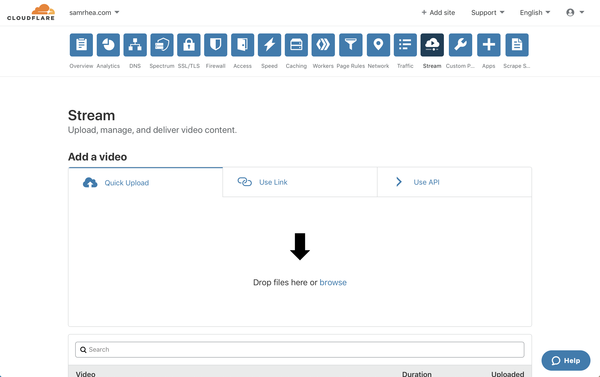
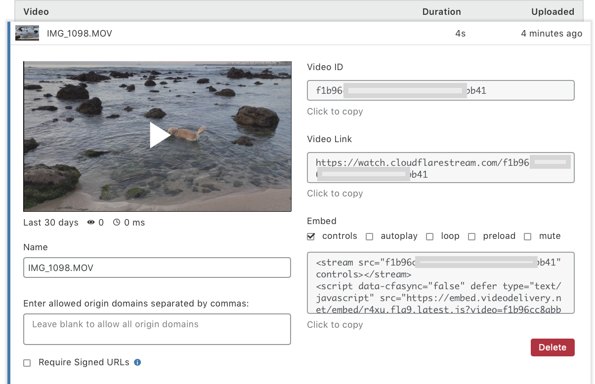
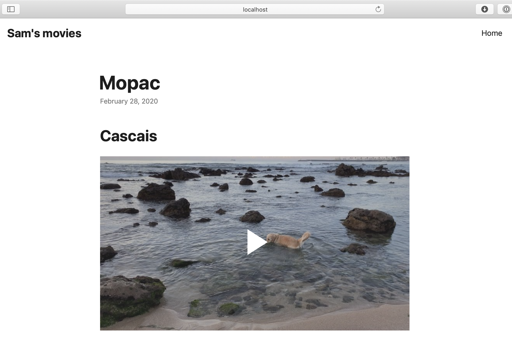
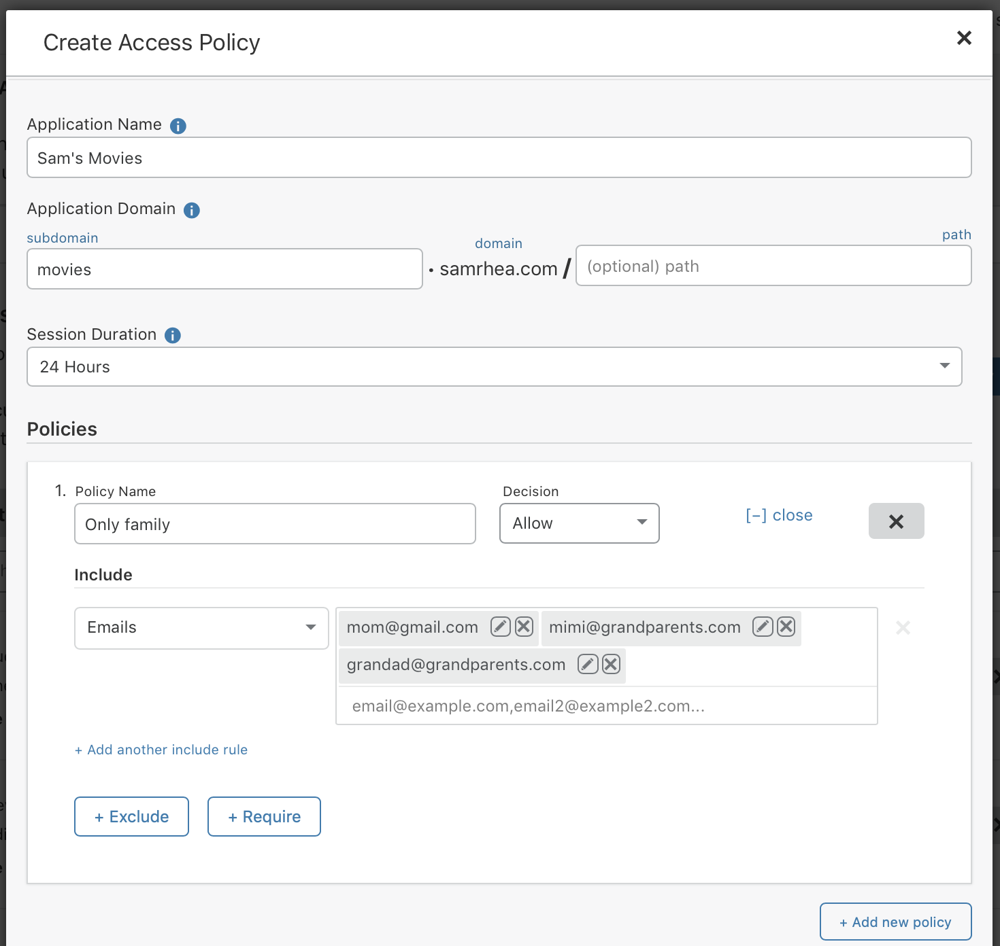
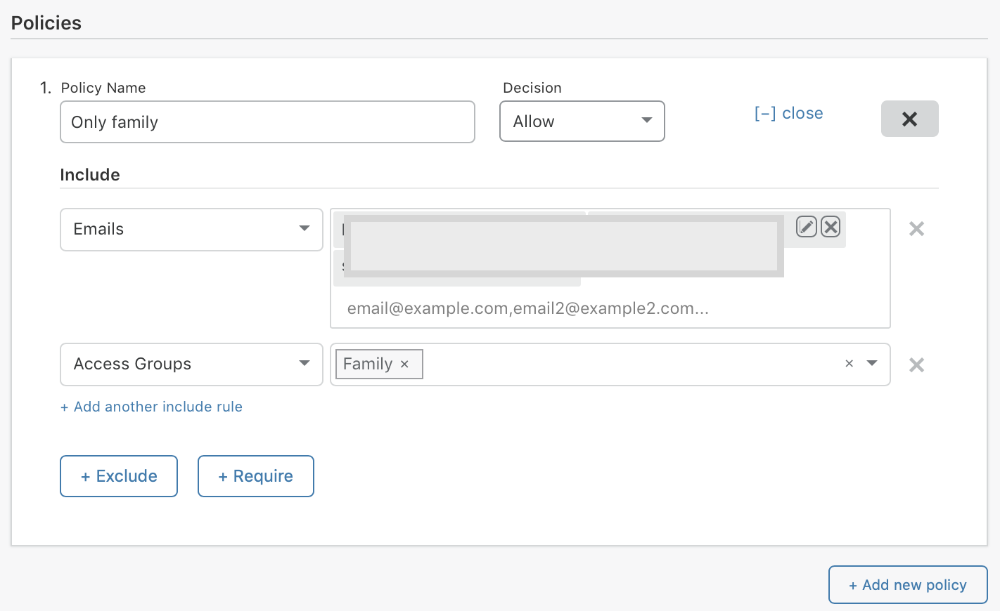
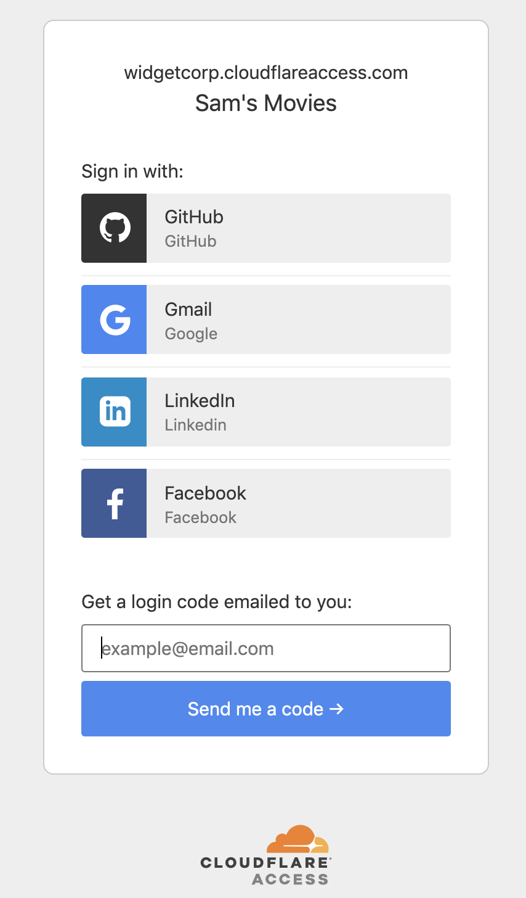

I live in Portugal, but I grew up in Texas. More specifically, I spent the first three decades of my life within 5 miles of where I was born in Austin, Texas. All of my friends and family are back there.

They miss me and my wife, but they mostly miss my dog, Mopac. As it turns out, the majority of the videos I take in Portugal are of my dog, and I want to share them with my family.

However, most methods for sharing videos are bad.

|Method|Why is it bad?|
|---|---|
|Send via messaging app|Lower quality, one-at-a-time, not everyone uses the same app. No curation|
|Share in Google Drive|I now have to ask my grandparents and everyone else to sign up for Google accounts|
|Facebook|Assumes everyone still uses Facebook, hard to only share with a few people, ads|
|YouTube|Similar to Facebook. Hard to share with a small audience, ads, requires accounts|

I want to send my family a link that has the videos. I want them to be able to login with any account they already use (or no account and just their email). I want them to not be served ads. I want them to be able to find videos in a simple web layout, but I don't want to manage an origin server for that.

So I'm going to solve this in about 30 minutes with Cloudflare Access and Cloudflare Stream, with some help from Cloudflare Workers.

---

**🎯 I have a few goals for this project:**

* Share videos with friends and family without sending them ads
* Only share videos with certain people
* Stop asking them to sign up for a new account

---

**🗺️ This walkthrough covers how to:**

* Serve videos on Cloudflare Stream
* Build a simple webpage using Workers Sites to house those videos
* Build a Cloudflare Access policy to share the page with family without them needing an account

**⏲️Time to complete: ~45 minutes**

---

> **👔 I work there.** I [work](https://www.linkedin.com/in/samrhea/) at Cloudflare. Most of my posts on this blog that discuss Cloudflare focus on building things with Workers Sites. I'm a Workers customer and [pay](https://twitter.com/LakeAustinBlvd/status/1200380340382191617) my invoice to use it. However, this experiment uses a product where I'm on the team (Access).

## Cloudflare Stream

[Cloudflare Stream](https://www.cloudflare.com/products/cloudflare-stream/) is Cloudflare's video platform. The streaming platform will store, encode, distribute and play videos. All I need to do is upload the video, which is all I want to do here.

I'll start by navigating to the Stream tab in the dashboard and uploading a photo of Mopac in the ocean near Cascais.



After a few seconds, the video is ready to go.



Stream includes a video player that will be embedded into the site. The view here gives me a few options to configure about the player.

> 🔐 I'm going to be placing the site that houses these videos behind Cloudflare Access, mostly just to keep the audience small and invite family. This video URL that is initially generated, while random, is available on the public Internet by default. However, that can be locked down using [Stream signed URLs](https://developers.cloudflare.com/stream/security/signed-urls/) so that the public links will not load. I'm going to skip walking through that step here and defer to the developer documentation.

I now have a video that I can embed in a webpage! This is particularly cool because this will be served by a Cloudflare data center close to my family back in Texas, not one here in Western Europe. Stream even prepares the embed link for me.

> Working at Cloudflare, I am always impressed by what my teammates build. In this case, I literally said out loud "whoa, dang that's cool" when I saw the embed link feature.

Now that I have videos available, I need to house them in a UI that my family can navigate. I don't want to manage an origin server for streaming video and I don't want to manage one for this webpage either. So I'm going to use Cloudflare's serverless platform, Workers, bo build a simple site for the videos.

## Building a site to house videos

I want to put the videos on a simple site. That way, I can send a single URL without instructions to my family and they can navigate between Mopac videos. I just want to use a gallery, nothing fancy.

I'm going to use Hugo and a lightweight template, [Hugo Paper](https://themes.gohugo.io/hugo-paper/), to build this out. And I'm going to deploy it to Cloudflare Workers, the same platform that runs this blog. I'll move fast during this part of the tutorial because I've written in a lot more detail about [using Hugo with Workers Sites](https://blog.samrhea.com/post/wrangler-sites/) and [automating their deployment](https://blog.samrhea.com/post/github-actions/).

Within this new site, I'll build a simple page to begin curating videos of Mopac. Right now, the entire content is just an index page and one markdown post that will house Mopac videos.

```md
---
title: Mopac
date: 2020-02-28
authors: Sam
---

## Cascais

<stream src="<video_id>" controls></stream>
<script data-cfasync="false" defer type="text/javascript" src="https://embed.videodelivery.net/embed/r4xu.fla9.latest.js?video=<video_id>"></script>
```

I can test that locally and it works!



I'll package up the Hugo site and use Wrangler to deploy it to a Cloudflare Workers site using a new hostname, `movies.samrhea.com`.

## Cloudflare Access and universal logins

Cloudflare Access is a bouncer that checks ID at the door. Any and every door.

Access is one-half of [Cloudflare for Teams](https://blog.cloudflare.com/cloudflare-for-teams-products/), Cloudflare's security platform that brings everything we learned building our network for your infrastructure and packages it into a solution to keep your team faster and safer as they do their work.

I write a lot about Access, it's part of my job, and I will avoid trying to repeat too much detail here. You can follow these links to learn more about using Access [for any login provider](https://blog.cloudflare.com/multi-sso-and-cloudflare-access-adding-linkedin-and-github-teams/), adding Access to protect [dev and QA sites](https://blog.samrhea.com/post/deploy-pipeline/), or [deploying it for an entire enterprise](https://blog.cloudflare.com/announcing-the-cloudflare-access-app-launch/).

In this case, I'm going to use it as a simple login gate so that only my family can watch the dozens and dozens of dog videos I capture.

The best part is **I don't need to ask them to sign up for a new account**. My grandparents can use their email address with any email domain. My mom can login with her GMail account. They can even use Facebook, if that's their preference.

I just need to build one rule to decide who can reach it.



I can make this even easier by creating an Access Group that contains all of my family members and then referencing it in the policy. That way, I only need to update the list of membership in one place and can use it across multiple policies.



Now, when anyone visits `movies.samrhea.com`, they are prompted to login.



My family members can pick the method they want to use (most will either have a code emailed to them or use the Gmail login).

And for something even more meta, here is a video (served by Stream) of the experience for someone using this.

<iframe
  src="https://iframe.videodelivery.net/4d3300dd2c50b01c13ce5ef946de6fde"
  style="border: none;"
  height="200"
  width="400"
  allow="accelerometer; gyroscope; autoplay; encrypted-media; picture-in-picture;"
  allowfullscreen="true"
></iframe>

## What does it cost?

All of this is going to cost me less than `$8`, but that fee includes the cost to run this blog and all of my other Workers projects. To even exceed $8, I would need thousands of family members to stream a lot of videos of my dog.

I use Cloudflare Workers Unlimited, which starts at `$5` per month and gets me both Workers and Workers KV. Stream costs `$1` per thousand minutes of video stored and an additional `$1` per thousand minutes viewed. I have a lot of Mopac videos, but not that many.

The first five seats in Access are free, too.

## What's next?

I can now add movies and share them with my family. My family can use any account to reach them and won't be served any ads. They'll also be easy to navigate on my new site and delivered closer to them, rather than crossing the Atlantic each time.

I sent this to my mom to test. Her only feedback was that the design I picked for the Hugo site was confusing. If that's the one problem here, I'm pretty happy with the outcome of the project. Now to fix the layout...