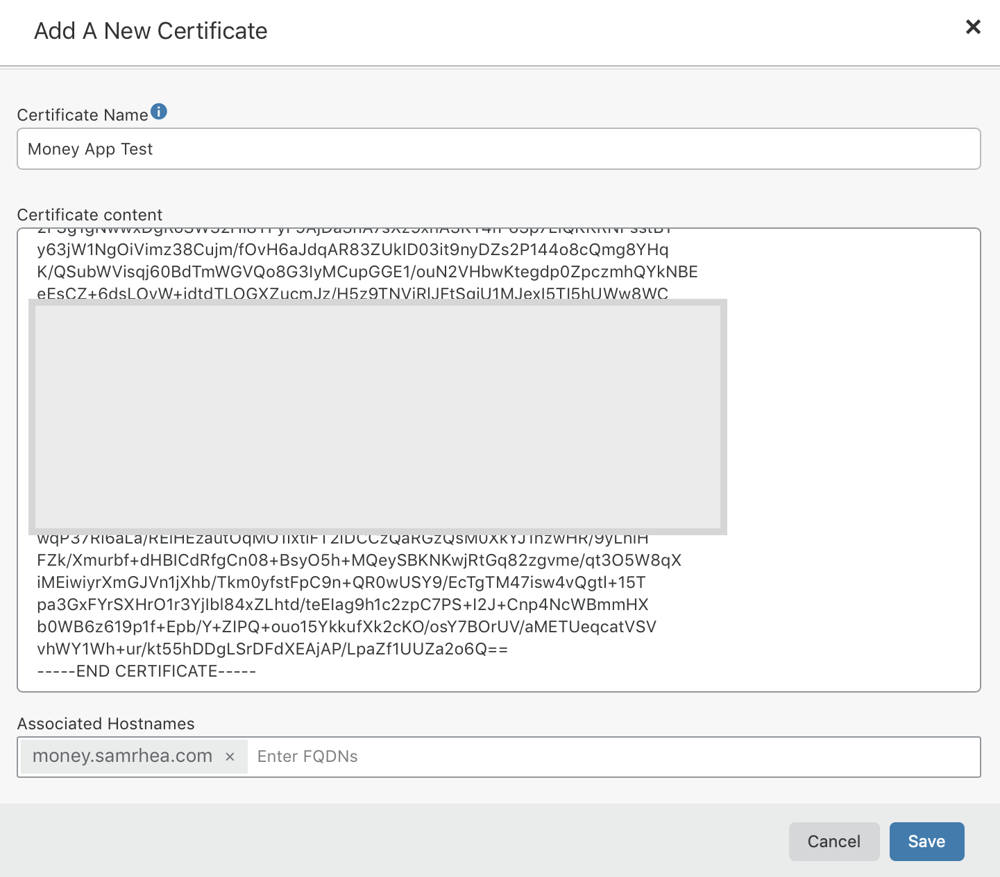
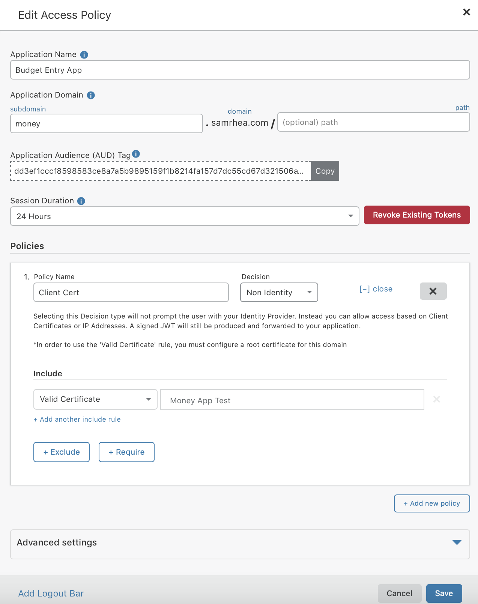
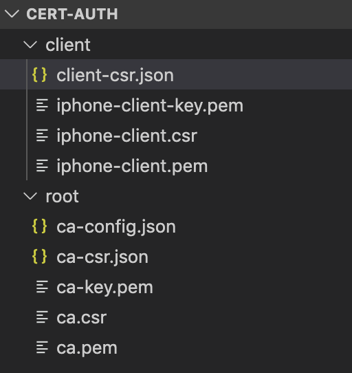
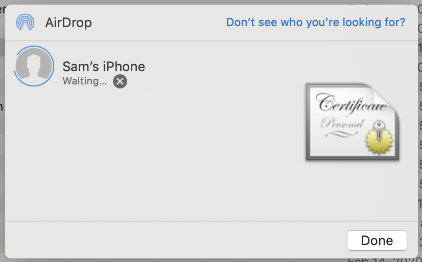
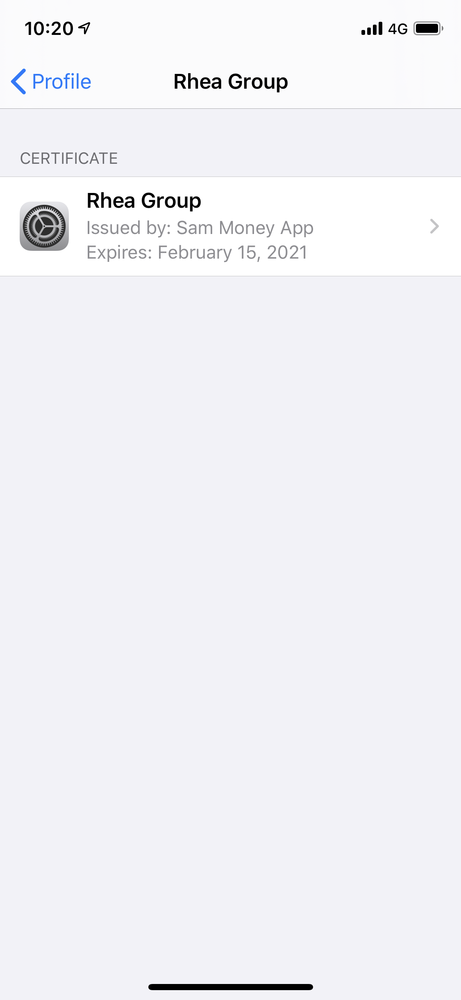
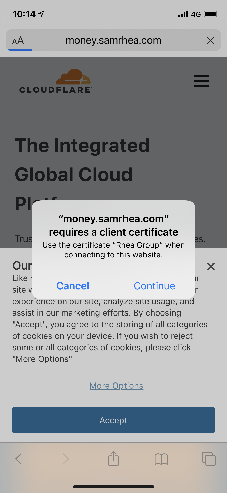

I keep a very detailed budget. I have for the last 7 years. I manually input every expense into a spreadsheet app (right now Google Sheets) and use a combination of `sumifs` functions to track spending.

Opening the spreadsheet app, and then the specific spreadsheet, every time that I want to submit an expense is a little clunky. I'm working on a new project to make that easier. I'm building a simple web app, with a very basic form, into which I will enter one-off expenses. This form will then append those expenses as rows into the budget workbook.

I want to lock down this project; I prefer that I am the only person with the power to wreck my budget. To do that, I'm going to use [Cloudflare Access](https://teams.cloudflare.com/access/index.html). With Access, I can require a login to reach the page - no server-side changes required.

Except, I don't want to allow logins from any device. For this project, I want to turn my iPhone into the only device that can reach this app.

---

**🎯 I have a few goals for this project:**

* Protect my prototype budget-entry app with authentication
* Avoid building a custom login flow into the app itself
* Use mutual TLS (mTLS) authentication so that only requests from my iPhone are allowed

---

**🗺️ This walkthrough covers how to:**

* Build an Access policy to enforce mutual TLS authentication
* Use Cloudflare's PKI toolkit to create a Root CA and then generate a client certificate
* Use OpenSSL to convert that client certificate into a format for iPhone usage
* Place that client certificate on my iPhone

**⏲️Time to complete: ~45 minutes**

---

> **👔 I work there.** I [work](https://www.linkedin.com/in/samrhea/) at Cloudflare. Most of my posts on this blog that discuss Cloudflare focus on building things with Workers Sites. I'm a Workers customer and [pay](https://twitter.com/LakeAustinBlvd/status/1200380340382191617) my invoice to use it. However, this experiment uses a product where I'm on the team.

## Cloudflare Access

Cloudflare Access is a bouncer that checks ID at the door. Any and every door.

Old models of security built on private networks operate like a guard at the front door of a large apartment building, except this apartment building does not have locks on any of the individual units. If you can walk through the front door, you could walk into any home. By default, private networks assume that a user on that network is trusted until proven malicious - you're free to roam the building until someone reports you. None of us want to live in that complex.

Access replaces that model with a bouncer in front of each apartment unit. Cloudflare checks every attempt to reach a protected app, machine, or remote desktop against rules that define who is allowed in.

To perform that check, Access needs to confirm a user's identity. To do that, teams can integrate Access with identity providers like G Suite, AzureAD, Okta or even Facebook and GitHub.

For this project, I want to limit not just **who** can reach the app, but also **what** can reach it. I want to only allow my particular iPhone to connect. Since my iPhone does not have its own GitHub account, I need to use a workflow that allows devices to authenticate: certificates, specificially mutual TLS (mTLS) certificate authentication.

> **📃 Please reach out.** Today, the mTLS feature in Access is only available to Enterprise plans. Are you on a self-serve plan and working on a project where you want to use mTLS? IoT, service-to-service, corporate security included. If so, please reach out to me at `srhea@cloudflare.com` and let's chat.

## mTLS and cfssl

Public key infrastructure (PKI) makes it possible for your browser to trust that this blog really is `blog.samrhea.com`. When you visit this blog, the site presents a certificate to tell your browser that it is the real `blog.samrhea.com`.

Your browser is skeptical. It keeps a short list of root certificates that it will trust. Your browser will only trust certificates signed by authorities in that list. Cloudflare [offers free certificates](https://support.cloudflare.com/hc/en-us/articles/204151138-Understanding-Universal-SSL) for hostnames using its reverse proxy. You can also get origin certificates from other services like Let's Encrypt. Either way, when you visit a web page with a certificate, you can ensure you are on the authentic site and that the traffic between you and the blog is encrypted.

For this project, I want to go the other direction. I want my device to present a certificate to Cloudflare Access demonstrating that it is my authentic iPhone. To do that, I need to create a chain that can issue a certificate to my device.

Cloudflare publishes an [open source](https://github.com/cloudflare/cfssl) PKI toolkit, `cfssl`, which can solve that problem for me. `cfssl` lets me quickly create a Root CA and then use that root to generate a client certificate, which will ultimately live on my phone.

To begin, I'll follow the instructions [here](https://github.com/cloudflare/cfssl#installation) to set up `cfssl` on my laptop. Once installed, I can start creating certificates.

## Generating a Root CA and an allegory about Texas

> **🥳 Shout out.** The core of the cert generation tutorial is an adaption of [new documentation](https://developers.cloudflare.com/access/service-auth/mtls/) in the Cloudflare developer portal based on a guide from James Royal on the Cloudflare Access team. Additionally, much of the details stem from Nick Sullivan's [blog post](https://blog.cloudflare.com/how-to-build-your-own-public-key-infrastructure/) introducing `cfssl`.

First, I need to create the Root CA. This root will give Access a basis for trusting client certificates. Think of the root as the Department of Motor Vehicles (DMV) in Texas. Only the State of Texas, through the DMV, can issue Texas driver licenses. Bouncers do not need to know about every driver license issued, but they do know to trust the State of Texas and how to validate Texas-issued licenses.

In this case, Access does not need to know about every client cert issued by this Root CA. The product only needs to know to trust this Root CA and how to validate if client certificates were issued by this root.

I'm going to start by creating a new directory, `cert-auth` to keep things organized. Inside of that directory, I'll create a folder, `root`, where I'll store the Root CA materials

Next, I'll define some details about the Root CA. I'll create a file, `ca-csr.json` and give it some specifics that relate to my deployment.

```json
{
    "CN": "Sam Money App",
    "key": {
      "algo": "rsa",
      "size": 4096
    },
    "names": [
      {
        "C": "PT",
        "L": "Lisboa",
        "O": "Money App Test",
        "OU": "Sam Projects",
        "ST": "Lisboa"
      }
    ]
  }
```

Now I need to configure how the CA will be used. I'll create another new file, `ca-config.json`, and add the following details.

```json
{
    "signing": {
      "default": {
        "expiry": "8760h"
      },
      "profiles": {
        "server": {
          "usages": ["signing", "key encipherment", "server auth"],
          "expiry": "8760h"
        },
        "client": {
          "usages": ["signing","key encipherment","client auth"],
          "expiry": "8760h"
        }
      }
    }
  }
```

The `ca-csr.json` file gives the Root CA a sense of identity and the `ca-config.json` will later define the configuration details when signing new client certificates.

With that in place, I can go ahead and create the Root CA. I'll run the following command in my terminal from within the `root` folder.

```bash
$ cfssl gencert -initca ca-csr.json | cfssljson -bare ca
```

The "Root CA" here is really a composition of three files, all of which are created by that command. `cfssl` generates a private key, a certificate signing request, and the certificate itself. The output should resemble this screenshot:


I need to guard the private key like it's the only thing that matters. In real production deployments, most organizations will create an intermediate certificate and sign client certificates with that intermediate. This allows administrators to keep the root locked down even further, they only need to handle it when creating new intermediates (and those intermediates can be quickly revoked). For this test, I'm just going to use a root to create the client certificates.

Now that I have the Root CA, I can upload the certificate in PEM format to Cloudflare Access. Cloudflare can then use that certificate to authenticate incoming requests for a valid client certificate.

In the Cloudflare Access dashboard, I'll use the card titled “Mutual TLS Root Certificates”. I can click "Add A New Certificate" and then paste the content of the `ca.pem` file directly into it.



I need to associate this certificate with a fully qualified domain name (FQDN). In this case, I'm going to use the certificate to authenticate requests for `money.samrhea.com`, so I'll just input that subdomain, but I could associate this cert with multiple FQDNs if needed.

Once saved, the Access dashboard will list the new Root CA.


## Building an Access Policy

Before I deploy the budget app prototype to `money.samrhea.com`, I need to lock down that subdomain with an Access policy.

In the Cloudflare dashboard, I'll select the zone `samrhea.com` and navigate to the Access tab. Once there, I can click `Create Access Policy` in the `Access Policies` card. That card will launch an editor where I can build out the rule(s) for reaching this subdomain.



In the example above, the policy will be applied to just the subdomain `money.samrhea.com`. I could make it more granular with path-based rules, but I'll keep it simple for now.

In the `Policies` section, I'm going to create a rule to allow client certificates signed by the Root CA I generated to reach the application. In this case, I'll pick "Non Identity" from the `Decision` drop-down. I'll then choose "Valid Certificate" under the `Include` details.

This will allow any valid certificate signed by the "Money App Test" CA I uploaded earlier. I could also build a rule using Common Names, but I'll stick with valid cert for now. I'll hit `Save` and finish the certificate deployment.

## Issuing client certs and converting to PKCS #12

So far, I have a Root CA and an Access policy that enforces mTLS with client certs issued by that Root CA. I've stationed a bouncer outside of my app and told them to only trust ID cards issued by The State of Texas. Now I need to issue a license in the form of a client certificate.

To avoid confusion, I'm going to create a new folder in the same directory as the `root` folder, this one called `client`. Inside of this directory, I'll create a new file: `client-csr.json` with the following `.json` blob:

``` json
{
    "CN": "Rhea Group",
    "hosts": [""],
    "key": {
      "algo": "rsa",
      "size": 4096
    },
    "names": [
      {
        "C": "PT",
        "L": "Lisboa",
        "O": "Money App Test",
        "OU": "Sam Projects",
        "ST": "Lisboa"
      }
    ]
  }
```

This sets configuration details for the client certificate that I'm about to request.

I can now use `cfssl` to generate a client certificate against my Root CA. The command below uses the `-profile` flag to create the client cert using the JSON configuration I just saved. This also gives the file the name `iphone-client`.

```bash
$ cfssl gencert -ca=../root/ca.pem -ca-key=../root/ca-key.pem -config=../root/ca-config.json -profile=client client-csr.json | cfssljson -bare iphone-client
```

The combined output should resemble the following:



| File | Description |
|---|---|
| `client-csr.json` | The JSON configuration created earlier to specify client cert details. |
| `iphone-client-key.pem` | The private key for the client certificate generated. |
| `iphone-client.csr` | The certificate signing request used to request the client cert. |
| `iphone-client.pem` | The client certificate created. |

With my freshly minted client certificate and key, I can go ahead and test that it works with my Access policy with a quick `cURL` command.

```bash
$ curl -v --cert iphone-client.pem --key iphone-client-key.pem https://money.samrhea.com
```

That works, but I'm not done yet. I need to get this client certificate on my iPhone. To do so, I need to convert the certificate and key into a format that my iPhone understands, PKCS #12.

[PKCS 12](https://tools.ietf.org/html/rfc7292) is a file format used for storing cryptographic objects. To convert the two `.pem` files, the certificate and the key, into PKCS 12, I'm going to use the [OpenSSL](https://www.openssl.org) command-line tool.

OpenSSL is a popular toolkit for TLS and SSL protocols that can solve a wide variety of certificate use cases. In my example, I just need it for one command:

```bash
$ openssl pkcs12 -export -out sam-iphone.p12 -inkey iphone-client-key.pem -in iphone-client.pem -certfile ../root/ca.pem
```

The command above takes the key and certificate generated previously and converts them into a single `.p12` file. I'll also be prompted to create an "Export Password". I'll use something that I can remember, because I'm going to need it in the next section.


## Authenticating from my iPhone

I now need to get the `.p12` file on my iPhone. In corporate environments, organizations distribute client certificates via mobile device management (MDM) programs or other tools. I'm just doing this for a personal test project, so I'm going to use AirDrop.



> **🚨 Careful!** This next step adds a certificate profile to your device from the self-signed chain created above. This can be very dangerous. Proceed with extreme caution.

Once my iPhone receives the file, I'll be prompted to select a device where the certificate will be installed as a device profile.


I'll then be prompted to enter my device password and the password set in the "Export" step above. Once complete, I can view the certificate under `Profiles` in `Settings`.



Now, when I visit `money.samrhea.com` for the first time from my phone, I'll be prompted to use the profile created.



Browsers can exhibit strange behavior when handling client certificate prompts. This should be the only time I need to confirm this profile should be used, but it might happen again.

## What's next?

My prototype personal finance app now is only accessible from my iPhone. This also makes it easy to login through Access from my device.

Access policies can be pretty flexible. If I want to reach it from a different device, I could build a rule to allow logins through Google as an alternative. I can also create a policy to require **both** a certificate and SSO login.

Beyond security, I can also build something with this client cert flow now. Cloudflare Access makes the details from the client cert, the ones I created earlier in this tutorial, [available](https://developers.cloudflare.com/access/service-auth/mtls-headers/) to Cloudflare Workers. I can start to create routing rules or trigger actions based on the details about this client cert.

In future posts, I'm going to walk through how to use these variables in Workers and how to use the JSON Web Tokens generated by Cloudflare Access to secure the app and enable some seamless SSO.

For now, I need to go finish building the actual expense entry piece...